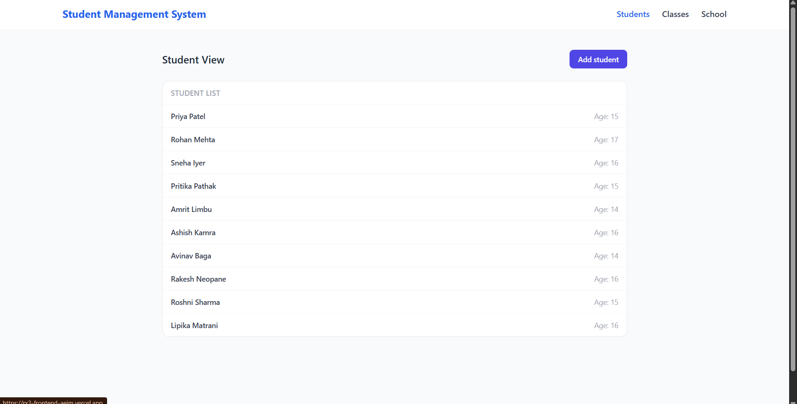
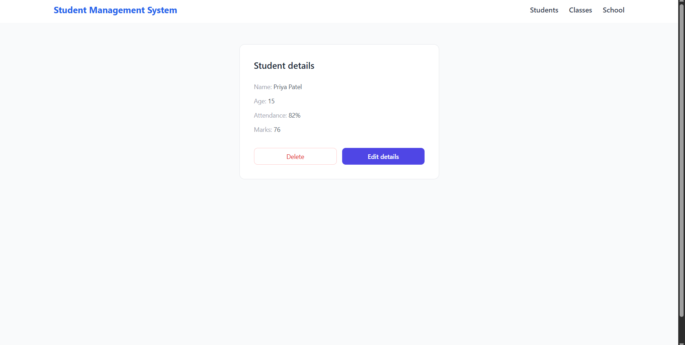
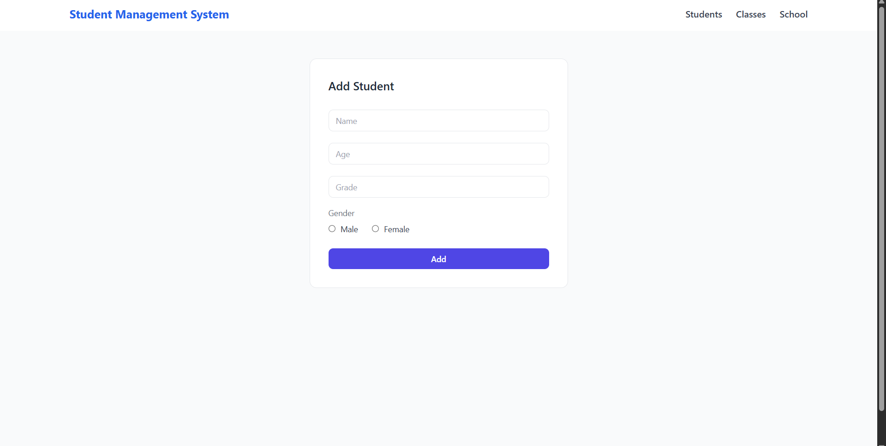
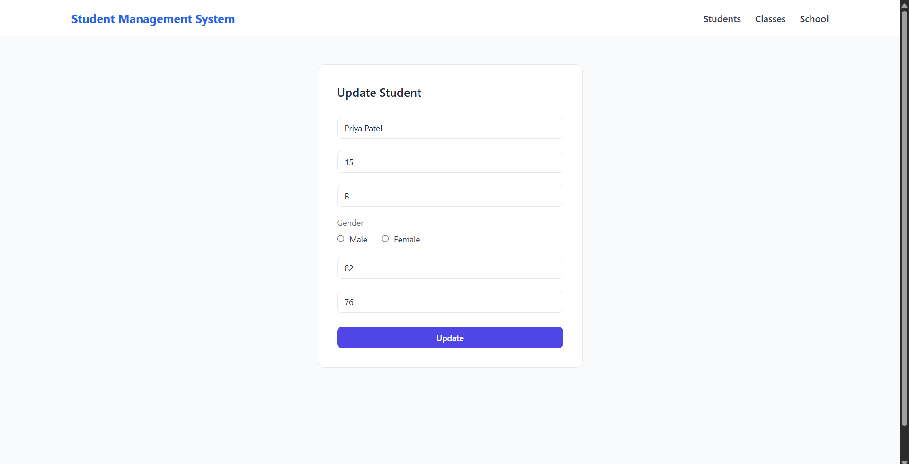
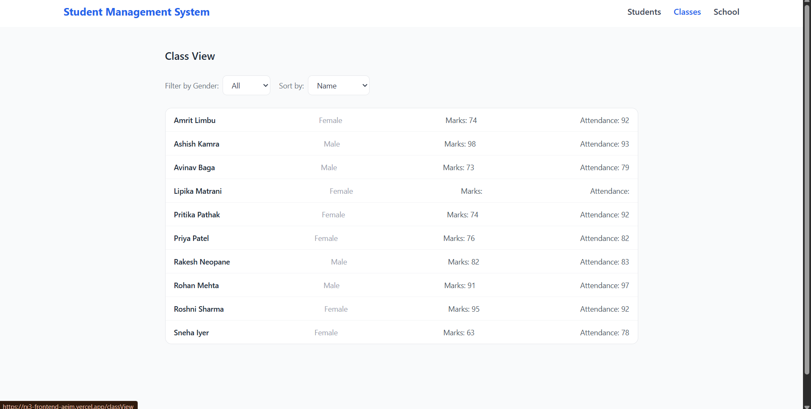
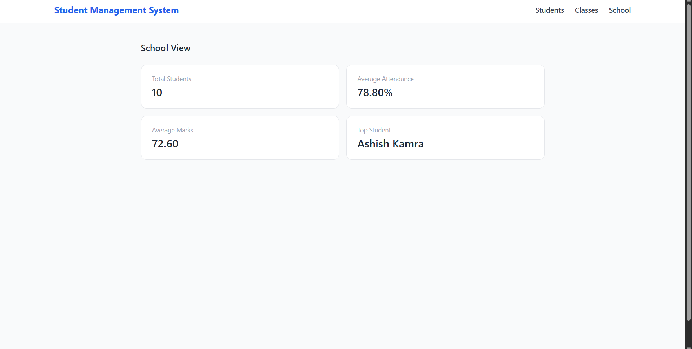

# Student Management System

A full-stack CRUD application for managing student records, built with React and Redux Toolkit on the frontend and Node.js/Express on the backend.

## Live Demo

Frontend: https://rx3-frontend-aeim.vercel.app
Backend API: https://rx-3-backend.vercel.app

---

## Tech Stack

### Frontend
- React 19
- Redux Toolkit + React Redux
- React Router DOM v7
- Axios
- Tailwind CSS v3
- Create React App

### Backend
- Node.js + Express
- MongoDB + Mongoose
- Vercel (serverless deployment)

---

## Features

- View all students in a clean list
- Add a new student
- Edit existing student details (name, age, grade, gender, attendance, marks)
- Delete a student
- Filter students by gender (All / Male / Female)
- Sort students by name, marks, or attendance
- School dashboard with stats: total students, average attendance, average marks, top student

---

## Project Structure
```
src/
├── features/
│   ├── student/
│   │   ├── studentSlice.js      # Redux slice + async thunks
│   │   ├── StudentView.jsx      # Student list page
│   │   ├── StudentList.jsx      # List component
│   │   ├── StudentDetails.jsx   # Individual student page
│   │   └── AddStudent.jsx       # Add / Edit form
│   ├── class/
│   │   └── ClassView.jsx        # Filter and sort view
│   └── school/
│       └── SchoolView.jsx       # School stats dashboard
├── pages/
│   └── Nav.jsx                  # Navigation bar
├── store/
│   └── store.js                 # Redux store setup
├── App.js
├── index.js
└── styles.css
```
---

## Prerequisites

- Node.js v18 or higher
- npm v9 or higher
- Git

---

## Getting Started

### 1. Clone the repository

```bash
git clone https://github.com/Rakeshneopane/rx3-frontend.git
cd rx3-frontend
```

### 2. Install dependencies

```bash
npm install --legacy-peer-deps
```

> `--legacy-peer-deps` is required because `react-scripts@5` has a peer dependency conflict with newer versions of some packages.

### 3. Set up environment variables

Create a `.env` file in the project root:
REACT_APP_BASE_URL=https://rx-3-backend.vercel.app

> Never commit this file to GitHub. It is already listed in `.gitignore`.

### 4. Start the development server

```bash
npm start
```

App runs at `http://localhost:3000`

---

## Available Scripts

| Command | Description |
|---|---|
| `npm start` | Runs the app in development mode at localhost:3000 |
| `npm run build` | Creates an optimized production build in the `build/` folder |
| `npm test` | Runs the test suite |

---

## Environment Variables

| Variable | Description | Example |
|---|---|---|
| `REACT_APP_BASE_URL` | Base URL of the backend API | `https://rx-3-backend.vercel.app` |

> In CRA, all environment variables exposed to the browser **must** be prefixed with `REACT_APP_`. They are baked into the JavaScript bundle at build time.

---

## Deployment (Vercel)

1. Push your code to GitHub
2. Go to [vercel.com](https://vercel.com) and import your repository
3. Vercel auto-detects CRA — no extra configuration needed
4. Go to **Settings → Environment Variables** and add:
   - Key: `REACT_APP_BASE_URL`
   - Value: your backend URL
5. Go to **Deployments** and click **Redeploy** after adding the variable

---

## API Endpoints

| Method | Endpoint | Description |
|---|---|---|
| GET | `/students` | Fetch all students |
| POST | `/students` | Add a new student |
| PUT | `/students/:id` | Update a student by ID |
| DELETE | `/students/:id` | Delete a student by ID |

---

## Known Limitations

- No authentication or authorization
- No pagination on the student list
- School stats are computed on the frontend on every render
- ESLint warnings suppressed via `DISABLE_ESLINT_PLUGIN=true` in production build

---

## Screenshots

### Student View


### Student Details


### Add / Edit Student



### Class View


### School View


---

## Author

Rakesh Kumar Neopane
GitHub: [@Rakeshneopane](https://github.com/Rakeshneopane)